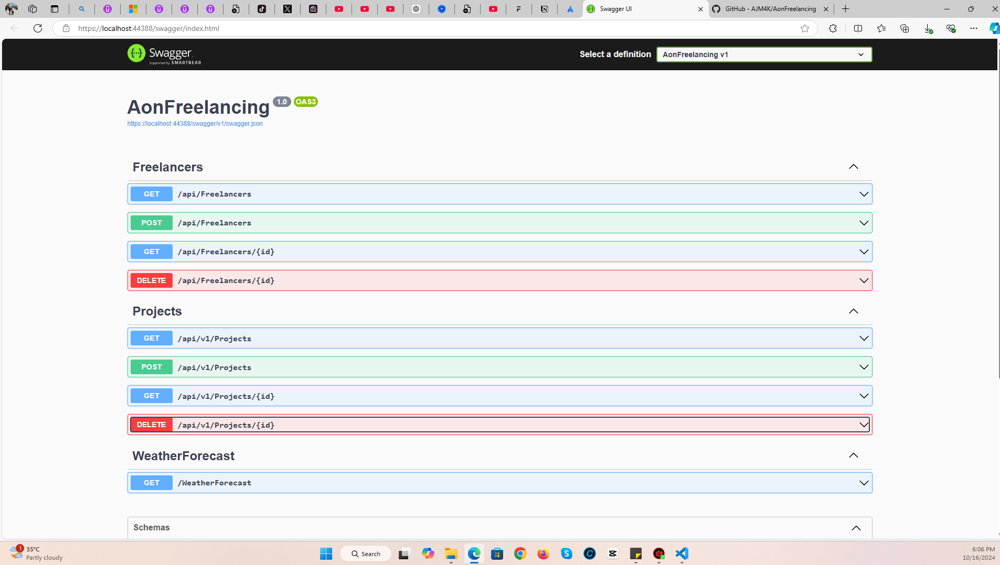

# Simple Web API in Dotnet 8

This is the second task that was assigned by AON 2 Backend Training 2024.

Done by: Ahmed Mahdi ( @AJM4K ) email: [AhmedMahdi.4k@gmail.com](mailto:AhmedMahdi.4k@gmail.com) phone: +9647838964777 Date: 16/10/2024

learning objective: create a model and a controller in a dotnet 8 project 

